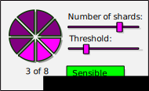

# UI Recommendations

The process of making social backups involves new concepts which can be difficult to understand.  So its important to have a carefully considered user interface, and choose good terminology to describe what is happening. 

It is also a good idea to let the peer know what is going to happen next, as this can inform the current decision.  For example, when choosing the number of shards, its good to know that they must then choose contacts which the shard will be sent to, as there is no point in choosing a high number of shards if they do not have many contacts to send them to.

In some cases it is better to first select the contacts, and then choose the threshold, with a recommended default value.

As an example, we will imagine making a social backup mechanism for an encrypted email client.

## Letting the peer choose the threshold and number of shards

Choosing good values for the number of custodians can be confusing, so its important that the interface encourages good values to be chosen, whilst allowing for some flexibility depending on the individual situation.  We recommend giving feedback similar to how when choosing a password you might receive feedback on how strong it is. 

Another option is to have sensible default values, for example 3 of 5, and only allow changing it as an 'advanced option'.  Some implementations of secret sharing use fixed parameters, and depending on the use case this can be a good idea, giving one less thing for the peer to consider.

Here is an example interface using sliders to set the values, and a feedback indicator:

With sensible values the indicator stays green.

With progressively less sensible values the indicator changes colour, indicating either a danger of loss (threshold too high) or insecurity (threshold too low, or number of shares too high).

## Letting the peer choose trusted contacts

In the protocol specification, we have used the term 'custodians' to describe the people who will hold the shards. For a user interface, we think this term is confusing, and would recommend either 'trusted contacts' or 'friends', depending on the context.

The way of choosing contacts will depend on the transport mechanism of your application.  With our example of an encrypted email client, the transport mechanism would be email, and the possible contacts would be those who also use encryption.  Many people will have the problem that the people they trust most are not available as contacts because of this.  Which is a big challenge for this design.

It is very important that peers do not choose the wrong contacts by mistake, so the interface should display as much information about the chosen contacts as possible before getting the peer to confirm the choice. So with the example of an email client, the interface might display a portion of the most recent message to or from that peer, to make it easier to recognise if the wrong contact has accidentally been chosen.

## Delivery confirmation

TODO

## Gaining consent from peers

TODO

## Push or pull notifications

TODO

## Contacting the trusted contacts following device loss

TODO

## Interface in original dark-crystal implementation

Unlike application-specific key backup mechanisms, the original dark-crystal implementation was designed to be a generic tool for backing up any key or secret, so the peer is able to enter the secret itself.

With integrated applications this is not necessary, which is lucky because the process of copying and pasting keys can be quite cumbersome, error-prone and has security issues. 

Here we see a short demo of entering data and selecting custodians in the original implementation.

This screenshot shows the history of a secret; who the shards were sent to and buttons to request them back.

## Learnings from original implementation

- [Peer testing and usability assessment](https://gitlab.com/dark-crystal/research/blob/master/dark_crystal-report_peer_testing_and_usability_assessment.md)
- [UX Report from UnderExposed Design Residency with Ura Design - Part1](https://gitlab.com/dark-crystal/research/blob/master/underexposed1.md)
- [UX Report from UnderExposed Design Residency with Ura Design - Part 2](https://gitlab.com/dark-crystal/research/blob/master/underexposed2.md)
