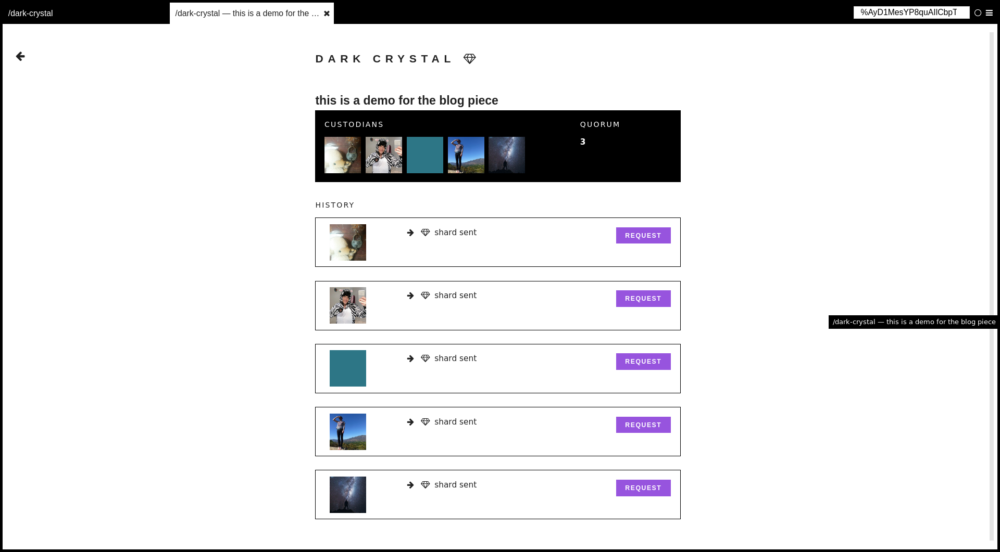

# UI Recommendations

## Letting user choose threshold with sliders

With sensible values the indicator stays green.

With progressively less sensible values the indicator changes colour, indicating either a danger of loss (threshold too high) or insecurity (threshold too low, or number of shares too high).

## Interface in original dark-crystal implementation

## Learnings from original implementation

- [Peer testing and usability assessment](https://gitlab.com/dark-crystal/research/blob/master/dark_crystal-report_peer_testing_and_usability_assessment.md)
- [UX Report from UnderExposed Design Residency with Ura Design - Part1](https://gitlab.com/dark-crystal/research/blob/master/underexposed1.md)
- [UX Report from UnderExposed Design Residency with Ura Design - Part 2](https://gitlab.com/dark-crystal/research/blob/master/underexposed2.md)
